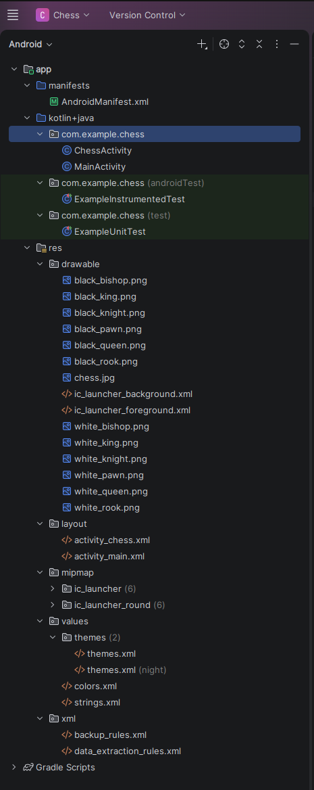
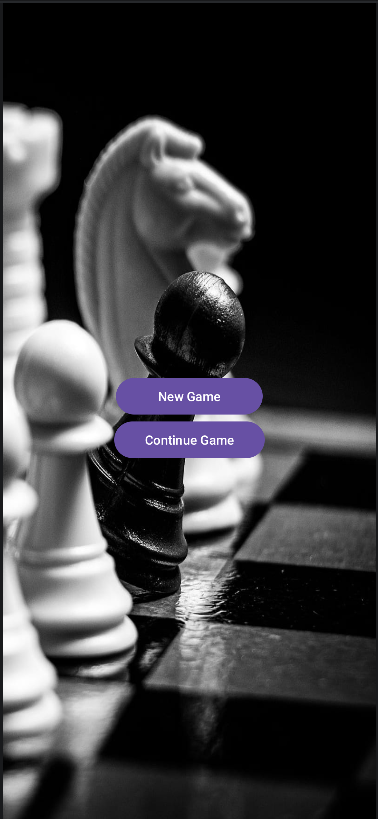
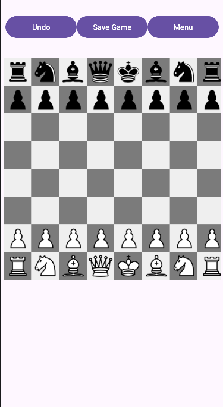

# Chess Mobile Application

## Application Overview

### MainActivity
The entry point of the application.  
It displays a simple menu with two options:
- Start a new chess game (clears previous saved data)
- Continue a previously saved game using SharedPreferences  

It navigates to `ChessActivity` depending on the user’s choice.

---

### ChessActivity
The core gameplay screen of the application.

It implements:
- An **8x8 chessboard** using `GridLayout`
- Full chess piece rendering using `ImageView`
- Turn-based gameplay (White / Black)
- Move validation for all chess pieces
- Undo system using a stack of moves
- Game saving/loading using `SharedPreferences`
- Game over detection when a king is captured

---

### Move System
Each move is stored in a `Stack<Move>` object which contains:
- From position (row, column)
- To position (row, column)
- Moved piece
- Captured piece

This allows the Undo feature to restore the previous game state.

---

### Persistence (Save/Load)
The game state is saved using `SharedPreferences`:
- Board state (8x8 matrix)
- Current turn (white/black)

This allows the game to continue after app restart.

---

## App Features

- New Game
- Continue Game
- Undo Move
- Save Game
- Interactive chessboard UI

---

## Tech Stack
- Java
- Android SDK
- GridLayout (chessboard UI)
- SharedPreferences (data persistence)

---

## Screenshots

### Project Structure

### Main Screen

### Game Screen

---
